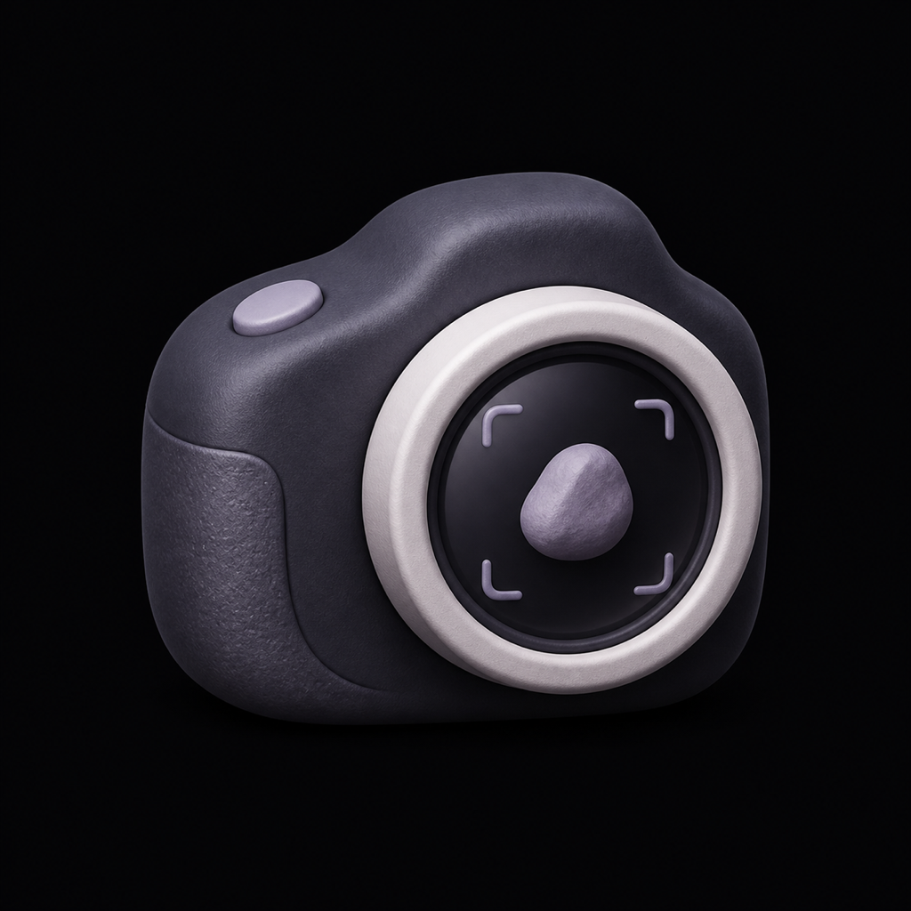
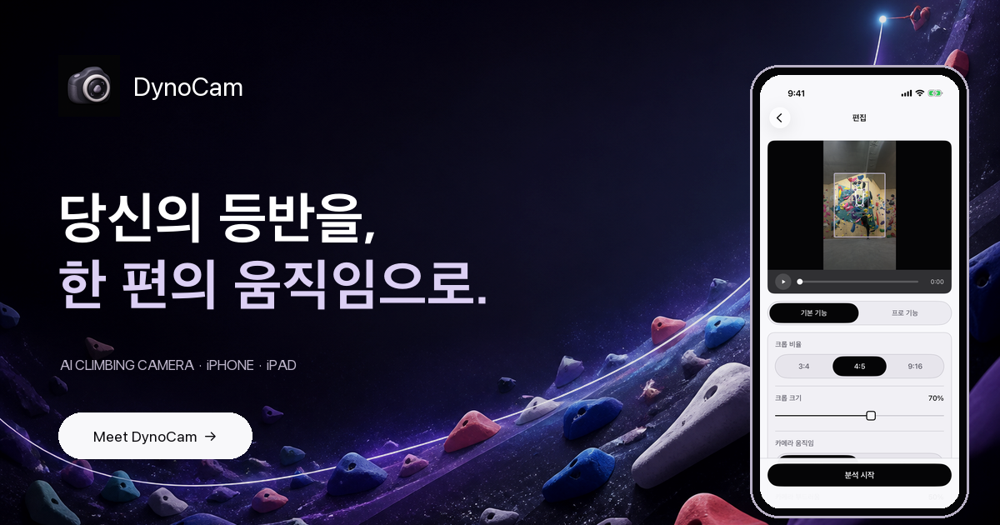
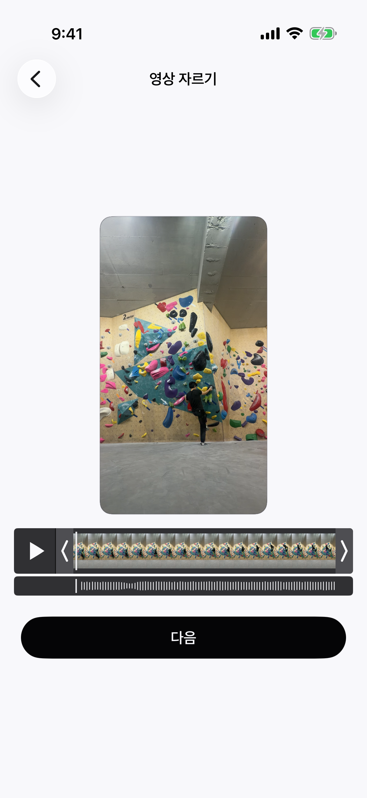
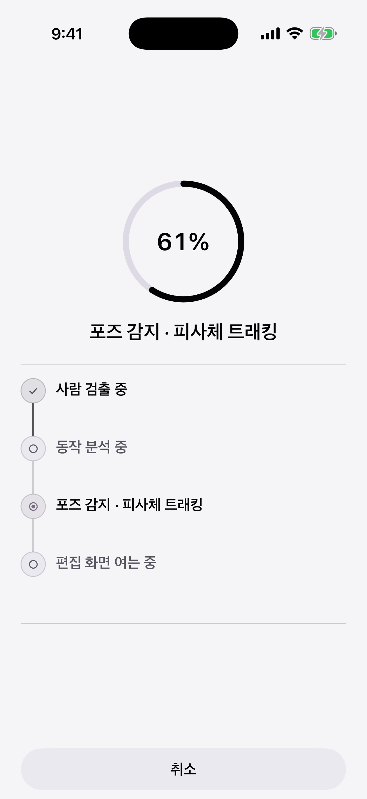
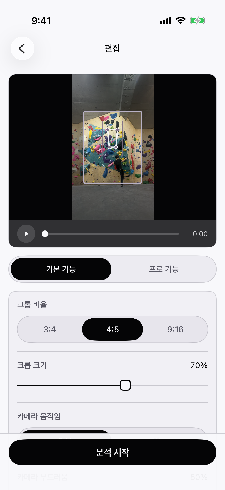

<p align="center">
  
</p>

<h1 align="center">DynoCam</h1>

<p align="center">
  <strong>당신의 움직임을, 한 편의 영상으로.</strong><br>
  영상 속 사람을 추적해 자동으로 세로 리프레임하는 iPhone·iPad용 AI 카메라입니다.
</p>

<p align="center">
  <a href="https://bbdyno.github.io/DynoCam-Site/"></a>
  <a href="https://apps.apple.com/app/id6800616313"></a>
  
  
</p>

<p align="center">
  
</p>

## 서비스 소개

삼각대에 세워둔 고정 영상에서도 주인공은 계속 움직입니다. DynoCam은 사람 검출과 포즈 추정을 결합해 이동 경로를 분석하고, 매 순간 새로운 카메라 프레임을 계산합니다. 클라이밍뿐 아니라 댄스, 피트니스, 스케이트와 여러 액션 스포츠 영상에 사용할 수 있습니다.

복잡한 편집 도구 없이 영상 구간을 고르고 원하는 비율을 선택하면, 클라이머를 중심에 둔 몰입감 있는 세로 영상을 만들 수 있습니다.

## 주요 기능

- **AI 인물 추적** — 사람과 포즈를 감지해 이동 경로를 계산합니다.
- **영상 구간 선택** — 타임라인과 오디오 파형으로 분석할 구간을 정밀하게 선택합니다.
- **세 가지 출력 비율** — `3:4`, `4:5`, `9:16` 세로 콘텐츠에 맞춘 프레임을 제공합니다.
- **카메라 움직임 조절** — 기본 및 예측형 카메라 움직임과 부드러움을 조절합니다.
- **추적 기준점 선택** — 상체, 몸통, 골반 등 움직임의 중심을 직접 선택합니다.
- **iPhone·iPad 지원** — 동일한 분석 흐름을 모바일과 넓은 편집 화면에서 사용할 수 있습니다.

## Free와 Pro

분석과 미리보기에는 횟수 제한이 없습니다. 광고는 전면 강제가 아닌 사용자가 직접 선택하는 리워드 방식입니다.

| 기능 | Free | Pro |
|---|---:|---:|
| 분석·미리보기 | 무제한 | 무제한 |
| 출력 화질 | 720p | 1080p |
| 출력 길이 | 최대 30초 | 선택한 전체 구간 |
| 워터마크 | 포함 | 없음 |
| 선택형 광고 | 1회 시청 시 해당 출력의 워터마크 제거 | 없음 |
| 선형 보정·초기 위치·정밀 재분석·포즈 오버레이 | — | 포함 |

- Pro Monthly: **US$1.99/month**
- Pro Yearly: **US$14.99/year**

실제 가격과 통화는 App Store 국가 또는 지역에 따라 표시됩니다.

## 실제 앱 화면

<table>
  <tr>
    <td align="center"><br><strong>구간 선택</strong></td>
    <td align="center"><br><strong>AI 분석</strong></td>
    <td align="center"><br><strong>프레임 편집</strong></td>
  </tr>
</table>

## 링크 및 버전

| 항목 | 내용 |
|---|---|
| 준비 중인 버전 | `1.0` (build 33) |
| 지원 기기 | iPhone, iPad |
| 제품 사이트 | [bbdyno.github.io/DynoCam-Site](https://bbdyno.github.io/DynoCam-Site/) |
| App Store | [apps.apple.com/app/id6800616313](https://apps.apple.com/app/id6800616313) · 심사 준비 중 |
| 앱 소스 저장소 | [github.com/bbdyno/DynoCam](https://github.com/bbdyno/DynoCam) |

## GitHub Pages 배포

이 저장소는 정적 사이트로 빌드되며 `main` 브랜치에 푸시되면 Pages 배포 워크플로가 실행됩니다.

저장소의 **Settings → Pages → Build and deployment → Source**에서 **GitHub Actions**를 선택하면 됩니다. 사용자가 Pages를 활성화하기 전까지 워크플로의 배포 단계가 대기하거나 실패할 수 있습니다.

```bash
npm install
npm run dev
npm test
npm run build:pages
```

정적 결과물은 `dist/client/`에 생성됩니다.

## 기술 구성

- React 19
- TypeScript
- React / Vite
- CSS 기반 반응형 모션 및 디바이스 프레임
- GitHub Actions / GitHub Pages

## 개인정보와 광고

영상 프레임과 추적 결과는 기기에서 처리되며 DynoCam 서버로 업로드되지 않습니다. 선택형 리워드 광고에는 Google Mobile Ads SDK와 User Messaging Platform이 사용됩니다. 자세한 내용은 [Privacy Policy](https://bbdyno.github.io/DynoCam-Site/privacy/)를 확인해 주세요.

사이트의 제품 화면은 실제 DynoCam 시뮬레이터 캡처를 사용하며, 클라이밍 모션 배경 이미지는 DynoCam을 위해 직접 제작한 오리지널 아트워크입니다.

## License

Copyright © 2026 DynoCam. See [LICENSE](LICENSE).
