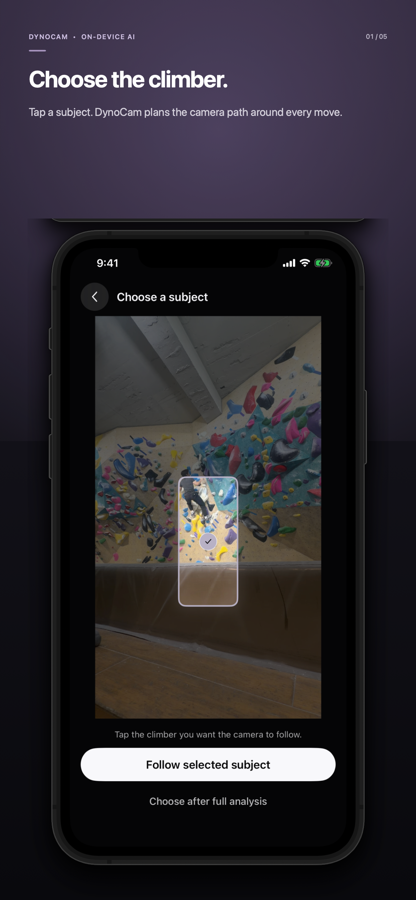
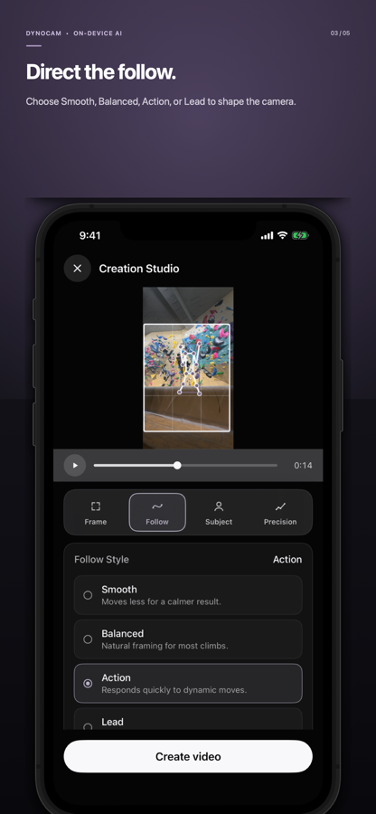
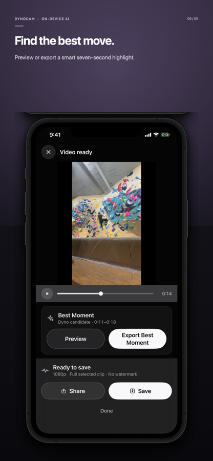

<p align="center">
  
</p>

<h1 align="center">DynoCam</h1>

<p align="center">
  <strong>최고의 무브는 이미 담겨 있습니다. 이제 카메라를 연출하세요.</strong><br>
  고정 촬영한 클라이밍 영상을 자연스러운 Follow Cam으로 만드는 iPhone·iPad용 AI 카메라 오퍼레이터입니다.
</p>

<p align="center">
  <a href="https://bbdyno.github.io/DynoCam-Site/"></a>
  <a href="https://apps.apple.com/app/id6800616313"></a>
  
  
</p>

<p align="center">
  
</p>

## 서비스 소개

삼각대에 세워둔 고정 영상에서도 클라이머는 계속 움직입니다. DynoCam은 사람 검출, 포즈 추정, Action Intelligence를 결합해 등반을 분석하고 카메라 경로를 설계합니다.

Follow Engine V2는 클라이머 경로와 카메라 경로를 분리합니다. 작은 흔들림은 줄이고 다음 무브는 미리 읽으며, 팬과 줌을 따로 제어해 단순 자동 크롭보다 자연스러운 Follow Cam을 만듭니다.

## 주요 기능

- **Follow Engine V2** — Dead Zone, Offline Look Ahead, Lead Room, 팬·줌 독립 제어로 카메라 패스를 만듭니다.
- **네 가지 Follow Style** — Balanced, Lead, Smooth(Pro), Action(Pro)으로 카메라 반응을 연출합니다.
- **Action Intelligence** — 역동적인 신체 움직임을 온디바이스로 인식하고 큰 무브에 맞춰 화면을 조절합니다.
- **Best Moment** — 가장 강한 7초를 추천하며 누구나 미리 보고 Pro에서 별도 영상으로 내보낼 수 있습니다.
- **세 가지 출력 비율** — `3:4`, `4:5`, `9:16` 세로 콘텐츠에 맞춘 프레임을 제공합니다.
- **실시간 카메라 패스 조절** — 재생 바를 다시 움직이지 않아도 비율과 프레임 크기 변경을 현재 화면에서 바로 확인합니다.
- **보정 및 정밀 분석** — 신뢰도가 낮거나 급격한 구간을 확인하고 Pro에서 범위 보정과 정밀 재분석을 실행합니다.
- **iPhone·iPad 지원** — 동일한 분석 흐름을 모바일과 넓은 편집 화면에서 사용할 수 있습니다.

## Free와 Pro

분석과 미리보기에는 횟수 제한이 없습니다. 광고는 전면 강제가 아닌 사용자가 직접 선택하는 리워드 방식입니다.

| 기능 | Free | Pro |
|---|---:|---:|
| 분석·미리보기 | 무제한 | 무제한 |
| 출력 화질 | 720p | 1080p |
| 출력 길이 | 최대 30초 | 선택한 전체 구간 |
| 워터마크 | 포함 | 없음 |
| 선택형 광고 | 1회 시청 시 1080p·최대 30초·워터마크 없는 출력 | 없음 |
| 고급 Follow Style·Action Framing·Best Moment 출력·그룹 추적·보정·정밀 재분석·포즈 오버레이·조건부 업스케일링 | — | 포함 |

Pro는 월간과 연간 플랜으로 제공되며 실제 가격과 통화는 App Store 국가 또는 지역에 따라 앱 안에 표시됩니다.

## 실제 앱 화면

<table>
  <tr>
    <td align="center"><br><strong>클라이머 선택</strong></td>
    <td align="center"><br><strong>Follow Style</strong></td>
    <td align="center"><br><strong>Best Moment</strong></td>
  </tr>
</table>

## 링크 및 버전

| 항목 | 내용 |
|---|---|
| 심사 중인 버전 | `1.0` (build 38) · Waiting for Review |
| 지원 기기 | iPhone, iPad |
| 제품 사이트 | [bbdyno.github.io/DynoCam-Site](https://bbdyno.github.io/DynoCam-Site/) |
| App Store | [apps.apple.com/app/id6800616313](https://apps.apple.com/app/id6800616313) · 심사 중, 승인 후 자동 출시 |
| 앱 소스 저장소 | [github.com/bbdyno/DynoCam](https://github.com/bbdyno/DynoCam) |

## 출시 후 후속 작업

승인 후에는 App Store 공개 여부, 두 Pro 구독, Coffee Tip의 판매 상태를 확인하고,
AdMob 앱을 공개된 App Store 목록에 연결합니다. 이어서 실기기에서 무료
워터마크 출력, 선택형 리워드 출력, Pro 무광고 출력과 구매 복원을 검증한 뒤
이 README의 `In Review` 표시를 실제 다운로드 링크로 전환합니다.

전체 운영 체크리스트는 앱 저장소의
[POST_RELEASE_CHECKLIST.md](https://github.com/bbdyno/DynoCam/blob/main/POST_RELEASE_CHECKLIST.md)에 기록되어 있습니다.

## GitHub Pages 배포

이 저장소는 정적 사이트로 빌드되며 `main` 브랜치에 푸시되면 Pages 배포 워크플로가 실행됩니다.

저장소의 **Settings → Pages → Build and deployment → Source**에서 **GitHub Actions**를 선택하면 됩니다. 사용자가 Pages를 활성화하기 전까지 워크플로의 배포 단계가 대기하거나 실패할 수 있습니다.

```bash
npm install
npm run dev
npm test
npm run build:pages
```

정적 결과물은 `dist/client/`에 생성됩니다.

## 기술 구성

- React 19
- TypeScript
- React / Vite
- 5개 언어 자동 감지 및 수동 전환
- CSS 기반 반응형 모션과 실제 App Store 기기 프레임 이미지
- GitHub Actions / GitHub Pages

## 개인정보와 광고

영상 프레임과 추적 결과는 기기에서 처리되며 DynoCam 서버로 업로드되지 않습니다. 선택형 리워드 광고에는 Google Mobile Ads SDK와 User Messaging Platform이 사용됩니다. 자세한 내용은 [Privacy Policy](https://bbdyno.github.io/DynoCam-Site/privacy/)를 확인해 주세요.

사이트의 제품 화면은 실제 DynoCam 시뮬레이터 캡처를 사용하며, 클라이밍 모션 배경 이미지는 DynoCam을 위해 직접 제작한 오리지널 아트워크입니다.

## License

Copyright © 2026 DynoCam. See [LICENSE](LICENSE).
